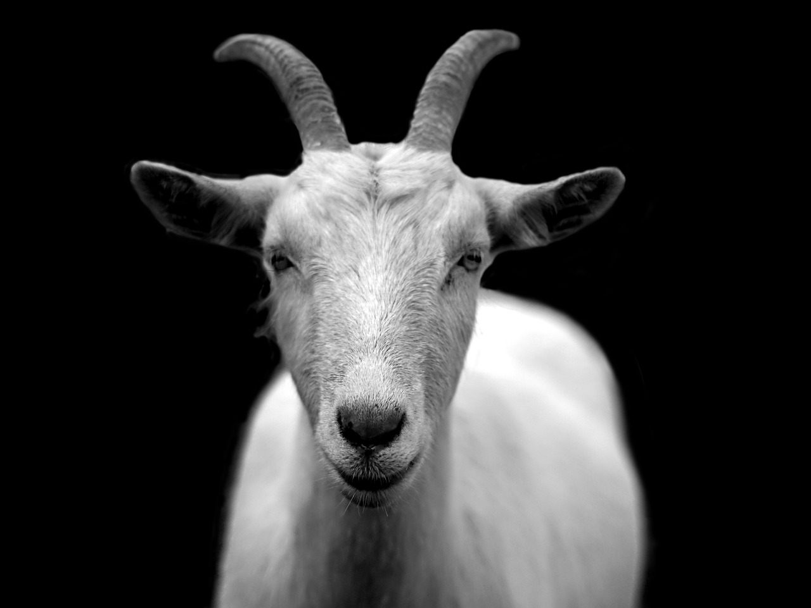
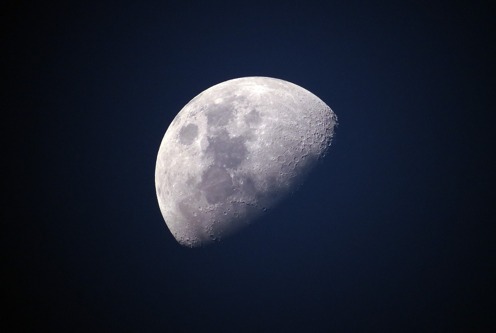
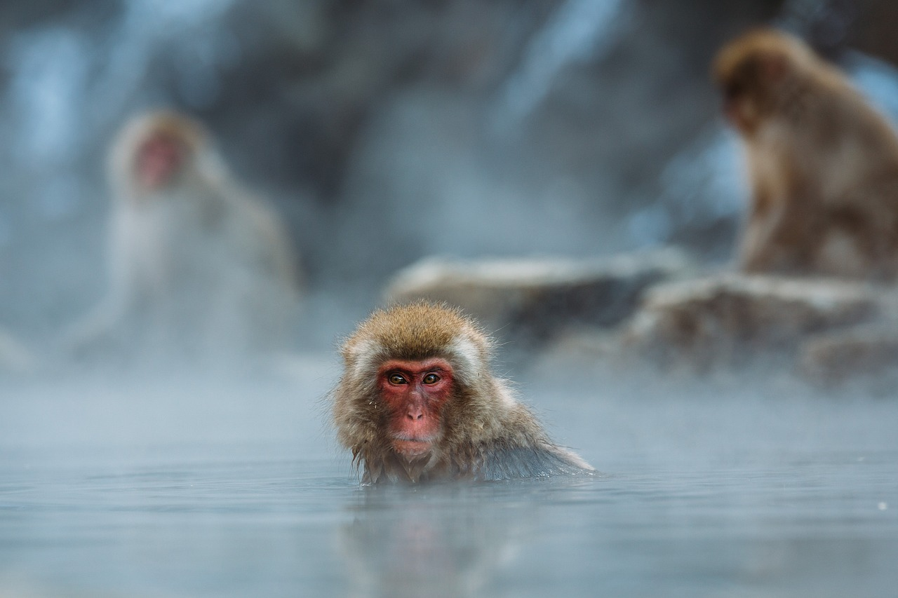
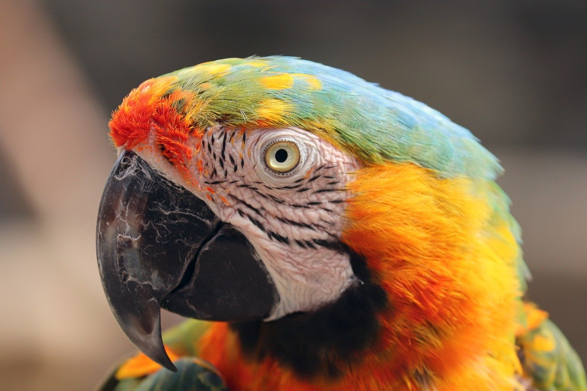
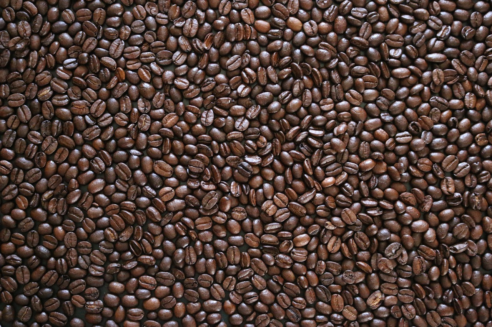
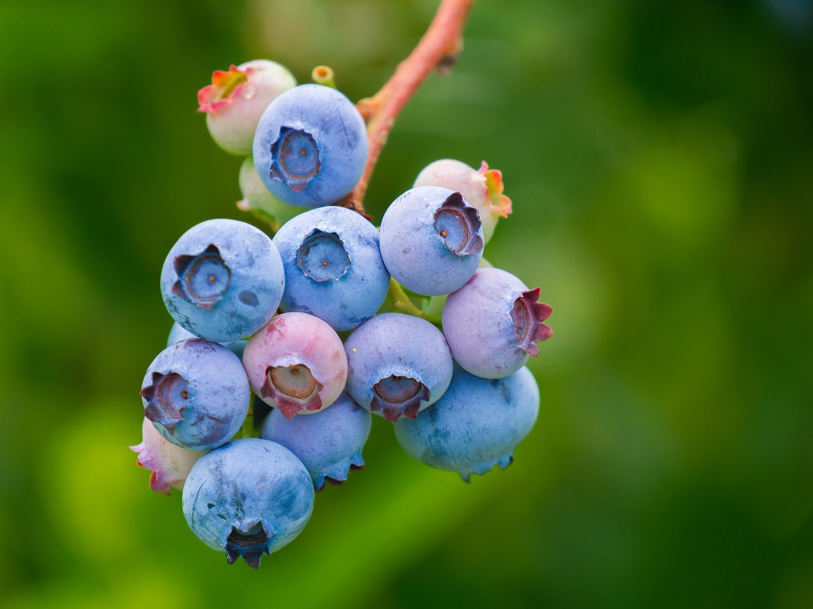
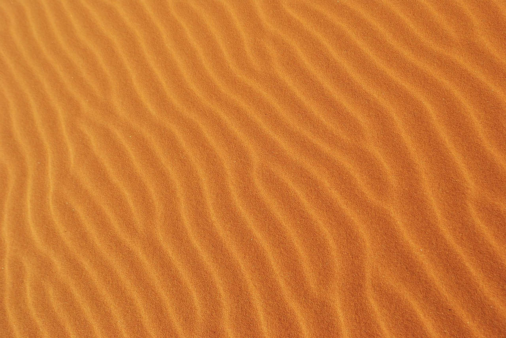
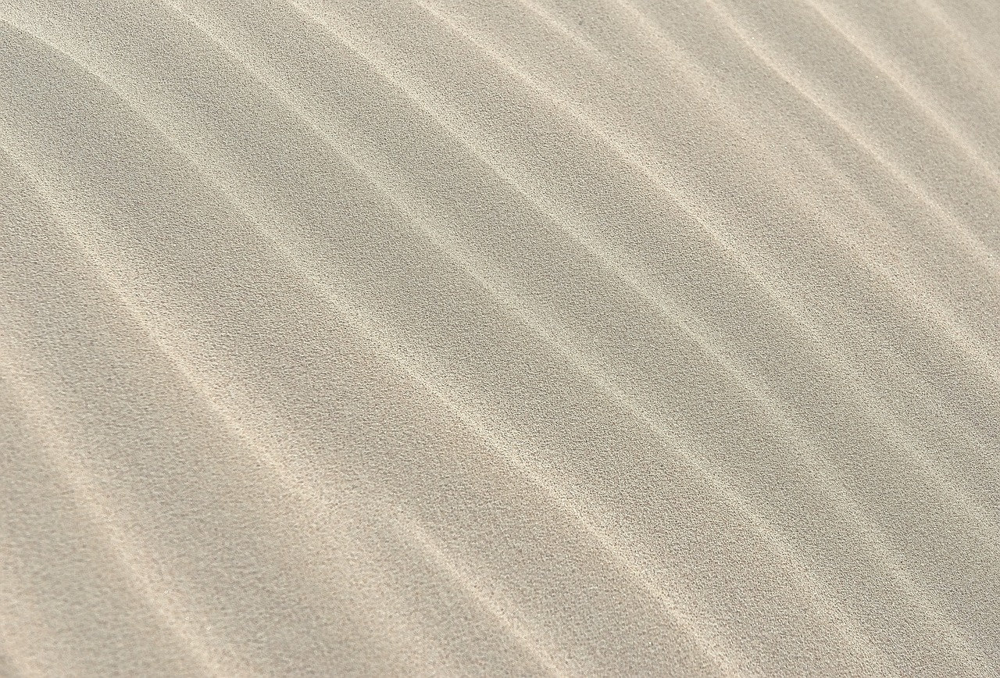
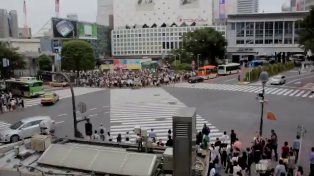

## 付録C 使用画像

本書の用例で示したサンプル画像は著者の生成したものか、[Pixabay](https://pixabay.com/ "LINK")から入手した「商用利用無料、帰属表示は必要ありません」のものです。Pixabayからダウンロードしたものを、登場順にすべて示します。見出しは筆者が便宜上付けたもので、オリジナルにはありません。

<!-- 編集さんへ: 縦に一列に並べていますが、横2列の格子状にしてほうがよいと思いますください。--->

● **踊る女の子のイラスト**（[第1章](./01-Terminology.md "INTERNAL")、[第5章](./05-Colors.md "INTERNAL")）by AnnaliseArt  

● **白い紙を広げた机**（[第1章](./01-Terminology.md "INTERNAL")、[第7章](./07-ImageProcesssing.md "INTERNAL")、[第9章](./09-Others.md "INTERNAL")）by coyot  

● **黒猫**（[第2章](./02-OpenShowClose.md "INTERNAL")、[第7章](./07-ImageProcesssing.md "INTERNAL")）by Milesz  

<!--- もとはRGBA（png）。こちらでRGBに変換した。--->
● **送電線**（[第3章](./03-Information.md "INTERNAL")、[第7章](./07-ImageProcesssing.md "INTERNAL")、[第8章](./08-Blend.md "INTERNAL")）by GDJ  

● **ビッグベン**（[第3章](./03-Information.md "INTERNAL")、[第7章](./07-ImageProcesssing.md "INTERNAL")、[第8章](./08-Blend.md "INTERNAL")）by Victoria_Borodinova  

● **フィレンツェの大聖堂**（[第3章](./03-Information.md "INTERNAL")、[第7章](./07-ImageProcesssing.md "INTERNAL")）by darrenquigley32  

● **山羊**（[第4章](./04-NewImage.md "INTERNAL")、[第5章](./05-Colors.md "INTERNAL")）by Chraecker  

● **月**（[第4章](./04-NewImage.md "INTERNAL")）by Ponciano  

● **虎**（[第4章](./04-NewImage.md "INTERNAL")、[第7章](./07-ImageProcesssing.md "INTERNAL")、[第8章](./08-Blend.md "INTERNAL")、[第9章](./09-Others.md "INTERNAL")）by Pixel-mixer  

<!-- Pixabayの画像はJPEGがほとんどだが、これはもともとPNG（ダウンロード時には.jpgが付いているがそれはウソ）--->
● **机の上のフレーム**（[第4章](./04-NewImage.md "INTERNAL")、[第5章](./05-Colors.md "INTERNAL")）by Pexcels  

● **温泉のサル**（[第4章](./04-NewImage.md "INTERNAL")、[第9章](./09-Others.md "INTERNAL")）by Pexcels  

● **オウム**（[第5章](./05-Colors.md "INTERNAL")）by manfredrichter  

● **コーヒー豆**（[第5章](./05-Colors.md "INTERNAL")、[第7章](./07-ImageProcesssing.md "INTERNAL")）by jotoh（本文では部分のみ）  

●**仔ダックスフンド**（[第7章](./07-ImageProcesssing.md "INTERNAL")、[第8章](./08-Blend.md "INTERNAL")）by PublicDomainPictures  

●**ブルーベリー**（[第7章](./07-ImageProcesssing.md "INTERNAL")、[第8章](./08-Blend.md "INTERNAL")）by ChiemSeherin (部分のみ利用した個所あり）  

●**少女とシャボン玉**（[第7章](./07-ImageProcesssing.md "INTERNAL")）by ddmitrova  

●**マフィン**（[第7章](./07-ImageProcesssing.md "INTERNAL")）by StockSnap  

● **砂（赤）**（[第8章](./08-Blend.md "INTERNAL")）by nike159  

● **砂（ベージュ）**（[第8章](./08-Blend.md "INTERNAL")）by nikokabeloptiv  

● **渋谷交差点**（[第8章](./08-Blend.md "INTERNAL")、[第9章](./09-Others.md "INTERNAL")）by Cover-Free-Footage  
 ... <a href="./Codes/Images/Crosswalk.mp4">ビデオはこちら</a>

<!-- Firefox の Markdown モジュール: 表示する -->
<!-- SublimeText のブラウザ表示機能: 動画制御フレームは表示するが、ヴィデオは読めないと言う --->
<!-- Github: まったくダメ --->
<!-- <video src="./Codes/Images/Crosswalk.mp4" poster="./Codes/Images/Crosswalk1.png" controls width=240></video> -->
